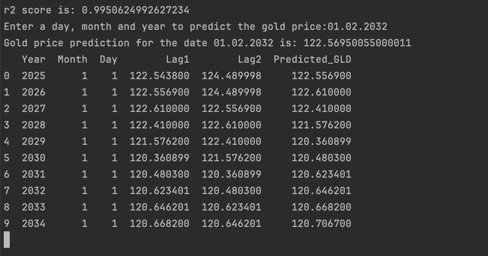
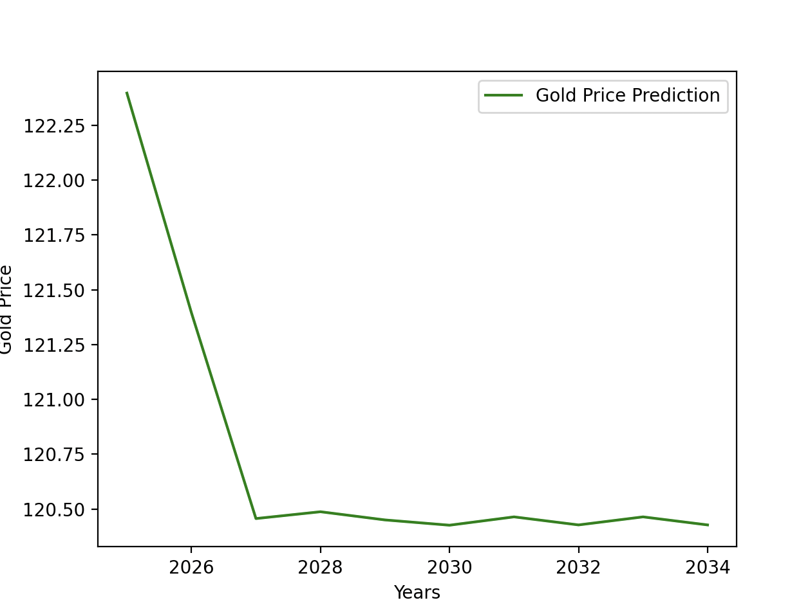
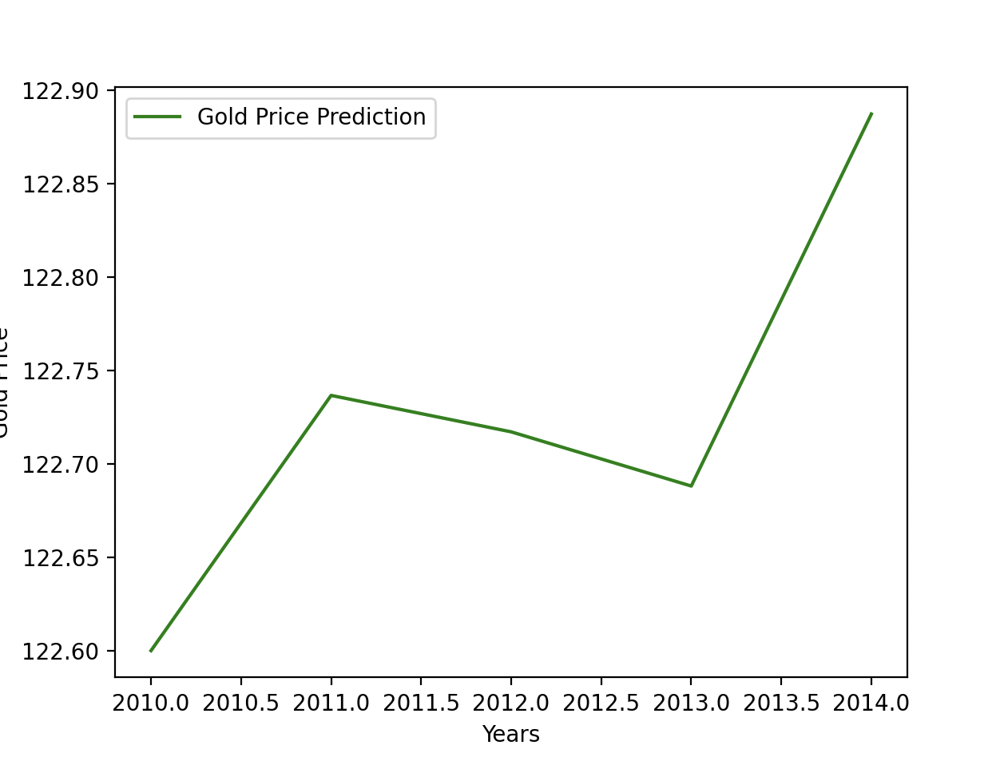
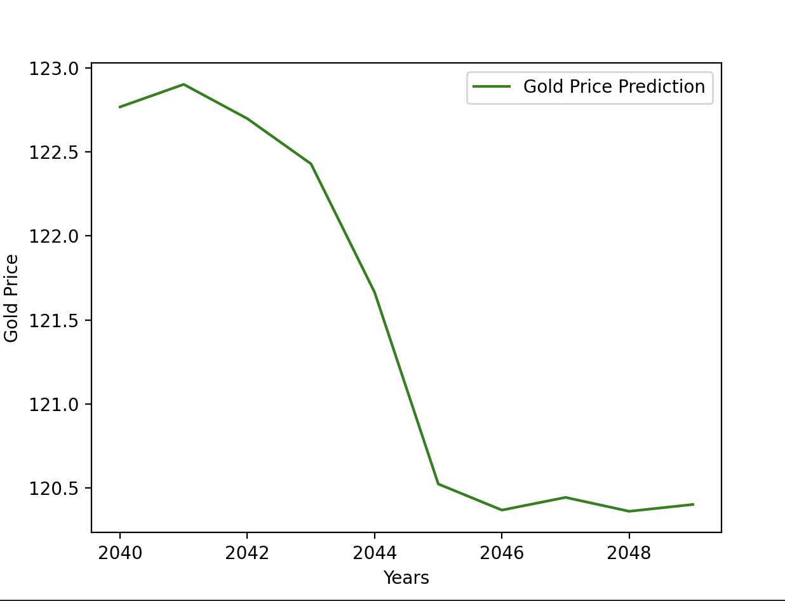

# Gold Price Prediction Project

## Project Overview

This project aims to predict the future prices of gold using historical gold price data and machine learning models. I have implemented RandomForestRegressor model. The project involves data preprocessing, feature extraction, model training, evaluation, and prediction. 


### Dataset

The dataset used in this project contains historical gold price data along with other financial indicators. The dataset is stored in a CSV file named gld_price_data.csv. The main features include:

- Date: The date of the observation
- GLD: The gold price
- SPX, USO, SLV, EUR/USD: Other financial indicators (dropped in preprocessing in the second model)

### Requirements

Python 3.6 or higher

Required Python libraries:
- numpy
- pandas
- matplotlib
- seaborn
- scikit-learn
- statsmodels

You can install the required libraries using the following command:


```python pip install -r requirements.txt ```
### Instructions

Data Preprocessing
- Load the Data: The dataset is loaded from the CSV file.
- Drop Unnecessary Columns: Columns SPX, USO, SLV, and EUR/USD are dropped as they are not used in the model.
- Extract Date Features: The 'Date' column is converted to datetime format, and new features such as 'Year', 'Month', and 'Day' are extracted.
### Model Training and Prediction
The project includes scripts for training and predicting using different models. Below are the steps for running the main script:

- Train Test Split: Split the data into training and testing sets.
- Model Training: Train a Random Forest Regressor or an ARIMA model on the training data.
- Model Evaluation: Evaluate the model using the R² score.
- Prediction: Make predictions for the test data and plot the results. Predict future gold prices for the next 10 years.

### Output





